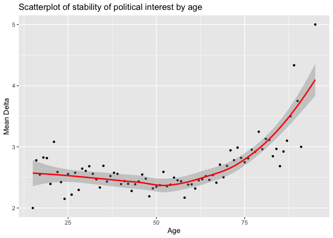

Statistical assignment 3
================
jjm230 124327
15/02/2020

In this assignment we will explore political interest (*vote6*) and how it changes over time.

Read data
---------

First we want to read and join the data for the first 7 waves of the Understanding Society. (Wave 8 does not have a variable for political interest). We only want five variables: personal identifier, sample origin, sex, age and political interest. It is tedious to join all the seven waves manually, and it makes sense to use a loop in this case. Since you don't yet know about iteration I'll provide the code for you; please see the explanation of the code here: <http://abessudnov.net/dataanalysis3/iteration.html>.

The only thing you need to do for this code to work on your computer is to provide a path to the directory where the data are stored on your computer.

``` r
library(tidyverse)
library(data.table)

# data.table is faster compared to readr so we'll use it in this case (the function fread()). You need to install this package first to be able to run this code.

# create a vector with the file names and paths

files <- dir(
             # Select the folder where the files are stored.
             "~/Documents/Exeter/Q-Step/POL2094 Data Analysis in Social Science III/Data III Project/Data III Project/data/UKDA-6614-tab/tab",
             # Tell R which pattern you want present in the files it will display.
             pattern = "indresp",
             # We want this process to repeat through the entire folder.
             recursive = TRUE,
             # And finally want R to show us the entire file path, rather than just
             # the names of the individual files.
             full.names = TRUE)

# Select only files from the UKHLS.
files <- files[stringr::str_detect(files, "ukhls")]
files
```

    ## [1] "/Users/Jacob/Documents/Exeter/Q-Step/POL2094 Data Analysis in Social Science III/Data III Project/Data III Project/data/UKDA-6614-tab/tab/ukhls_w1/a_indresp.tab"
    ## [2] "/Users/Jacob/Documents/Exeter/Q-Step/POL2094 Data Analysis in Social Science III/Data III Project/Data III Project/data/UKDA-6614-tab/tab/ukhls_w2/b_indresp.tab"
    ## [3] "/Users/Jacob/Documents/Exeter/Q-Step/POL2094 Data Analysis in Social Science III/Data III Project/Data III Project/data/UKDA-6614-tab/tab/ukhls_w3/c_indresp.tab"
    ## [4] "/Users/Jacob/Documents/Exeter/Q-Step/POL2094 Data Analysis in Social Science III/Data III Project/Data III Project/data/UKDA-6614-tab/tab/ukhls_w4/d_indresp.tab"
    ## [5] "/Users/Jacob/Documents/Exeter/Q-Step/POL2094 Data Analysis in Social Science III/Data III Project/Data III Project/data/UKDA-6614-tab/tab/ukhls_w5/e_indresp.tab"
    ## [6] "/Users/Jacob/Documents/Exeter/Q-Step/POL2094 Data Analysis in Social Science III/Data III Project/Data III Project/data/UKDA-6614-tab/tab/ukhls_w6/f_indresp.tab"
    ## [7] "/Users/Jacob/Documents/Exeter/Q-Step/POL2094 Data Analysis in Social Science III/Data III Project/Data III Project/data/UKDA-6614-tab/tab/ukhls_w7/g_indresp.tab"
    ## [8] "/Users/Jacob/Documents/Exeter/Q-Step/POL2094 Data Analysis in Social Science III/Data III Project/Data III Project/data/UKDA-6614-tab/tab/ukhls_w8/h_indresp.tab"
    ## [9] "/Users/Jacob/Documents/Exeter/Q-Step/POL2094 Data Analysis in Social Science III/Data III Project/Data III Project/data/UKDA-6614-tab/tab/ukhls_w9/i_indresp.tab"

``` r
# create a vector of variable names
vars <- c("memorig", "sex_dv", "age_dv", "vote6")

for (i in 1:7) {
        # Create a vector of the variables with the correct prefix.
        varsToSelect <- paste(letters[i], vars, sep = "_")
        # Add pidp to this vector (no prefix for pidp)
        varsToSelect <- c("pidp", varsToSelect)
        # Now read the data. 
        data <- fread(files[i], select = varsToSelect)
        if (i == 1) {
                all7 <- data  
        }
        else {
                all7 <- full_join(all7, data, by = "pidp")
        }
        # Now we can remove data to free up the memory.
        rm(data)
} 
```

Reshape data (20 points)
------------------------

Now we have got the data from all 7 waves in the same data frame **all7** in the wide format. Note that the panel is unbalanced, i.e. we included all people who participated in at least one wave of the survey. Reshape the data to the long format. The resulting data frame should have six columns for six variables.

``` r
Long <- all7 %>%                                                                    # Create Long from all7, by
  pivot_longer(a_memorig:g_vote6, names_to = "variable", values_to = "value") %>%   # lengthening the data stored between a_memorig and g_vote6, naming the variable col. 'variable' and the value col. 'value' (hence creating a 'superlong' data-frame), and then
  separate(variable, into = c("wave", "variable"), sep = "_", extra = "merge") %>%  # separating 'variable' into a var. 'wave' and a var. 'variable' by the character '_', whilst only splitting additional pieces a maximum of length(into) times, and then
  pivot_wider(names_from = variable, values_from = value)                           # widening the data, taking vars. from 'variable' and obs. from 'value'
Long                                                                                # Print Long
```

    ## # A tibble: 584,234 x 6
    ##        pidp wave  memorig sex_dv age_dv vote6
    ##       <int> <chr>   <int>  <int>  <int> <int>
    ##  1 68001367 a           1      1     39     3
    ##  2 68001367 b          NA     NA     NA    NA
    ##  3 68001367 c          NA     NA     NA    NA
    ##  4 68001367 d          NA     NA     NA    NA
    ##  5 68001367 e          NA     NA     NA    NA
    ##  6 68001367 f          NA     NA     NA    NA
    ##  7 68001367 g          NA     NA     NA    NA
    ##  8 68004087 a           1      1     59     2
    ##  9 68004087 b           1      1     60     2
    ## 10 68004087 c           1      1     61     2
    ## # … with 584,224 more rows

Filter and recode (20 points)
-----------------------------

Now we want to filter the data keeping only respondents from the original UKHLS sample for Great Britain (memorig == 1). We also want to clean the variables for sex (recoding it to "male" or "female") and political interest (keeping the values from 1 to 4 and coding all negative values as missing). Tabulate *sex* and *vote6* to make sure your recodings were correct.

``` r
Long <- Long %>%                                                       # Create Long from Long, by
        filter(memorig==1) %>%                                         # filtering for obs. for which memorig equals 1 only, and then
        mutate(sex_dv = ifelse(sex_dv==1, "male",                      # mutating sex_dv such that if its vals. equal 1, then "male", else
                               ifelse(sex_dv==2, "female", NA))) %>%   # if its vals. equal 2, then "female", else NA, and then
        mutate(vote6 = ifelse(vote6 < 1, NA, vote6))                   # mutating vote6 such that if its vals. are less than 1, then NA, else do nothing.

Long$sex_dv <- as.factor(Long$sex_dv)                                  # Compel Long$sex_dv to a factor var.

summary(Long)                                                          # Summarise Long (to count of NAs)
```

    ##       pidp               wave              memorig     sex_dv      
    ##  Min.   :6.800e+07   Length:218015      Min.   :1   female:117665  
    ##  1st Qu.:4.761e+08   Class :character   1st Qu.:1   male  :100342  
    ##  Median :8.841e+08   Mode  :character   Median :1   NA's  :     8  
    ##  Mean   :8.535e+08                      Mean   :1                  
    ##  3rd Qu.:1.226e+09                      3rd Qu.:1                  
    ##  Max.   :1.638e+09                      Max.   :1                  
    ##                                                                    
    ##      age_dv           vote6      
    ##  Min.   : -9.00   Min.   :1.000  
    ##  1st Qu.: 33.00   1st Qu.:2.000  
    ##  Median : 48.00   Median :3.000  
    ##  Mean   : 48.26   Mean   :2.691  
    ##  3rd Qu.: 63.00   3rd Qu.:4.000  
    ##  Max.   :104.00   Max.   :4.000  
    ##                   NA's   :17124

``` r
table(Long$sex_dv)                                                     # Tabulate Long$sex_dv
```

    ## 
    ## female   male 
    ## 117665 100342

``` r
table(Long$vote6)                                                      # Tabulate Long$vote6
```

    ## 
    ##     1     2     3     4 
    ## 21660 70952 56134 52145

Calculate mean political interest by sex and wave (10 points)
-------------------------------------------------------------

Political interest is an ordinal variable, but we will treat it as interval and calculate mean political interest for men and women in each wave.

``` r
meanVote6 <- Long %>%                                                # Create meanVote6 from Long, by
  group_by(wave) %>%                                                 # grouping according to 'wave', and then
  summarise(meanMen = mean(vote6[sex_dv=="male"], na.rm = TRUE),     # summarising into a var. 'meanMen', defined as the mean of vals. within 'sex_dv' which equal "male", removing missing vals., and
            meanWomen = mean(vote6[sex_dv=="female"], na.rm = TRUE)) # into a var. 'meanWomen', defined as the mean of vals. within 'sex_dv' which equal "female", removing missing vals.
        
meanVote6                                                            # Print meanVote6
```

    ## # A tibble: 7 x 3
    ##   wave  meanMen meanWomen
    ##   <chr>   <dbl>     <dbl>
    ## 1 a        2.53      2.84
    ## 2 b        2.51      2.82
    ## 3 c        2.54      2.87
    ## 4 d        2.55      2.89
    ## 5 e        2.51      2.87
    ## 6 f        2.47      2.81
    ## 7 g        2.42      2.73

Reshape the data frame with summary statistics (20 points)
----------------------------------------------------------

Your resulting data frame with the means is in the long format. Reshape it to the wide format. It should look like this:

| sex\_dv | a   | b   | c   | d   | e   | f   | g   |
|---------|-----|-----|-----|-----|-----|-----|-----|
| female  |     |     |     |     |     |     |     |
| male    |     |     |     |     |     |     |     |

In the cells of this table you should have mean political interest by sex and wave.

Write a short interpretation of your findings.

``` r
meanVote6 %>%                                                                      # Call meanVote6, and then
  pivot_longer(meanMen:meanWomen, names_to = "variable", values_to = "value") %>%  # lengthen the data stored between meanMen and meanWomen, naming the variable col. 'variable' and the value col. 'value' (hence creating a 'superlong' data-frame), and then
  pivot_wider(names_from = "wave", values_from = "value")                          # widen the data, taking vars. from 'wave' and obs. from 'value'
```

    ## # A tibble: 2 x 8
    ##   variable      a     b     c     d     e     f     g
    ##   <chr>     <dbl> <dbl> <dbl> <dbl> <dbl> <dbl> <dbl>
    ## 1 meanMen    2.53  2.51  2.54  2.55  2.51  2.47  2.42
    ## 2 meanWomen  2.84  2.82  2.87  2.89  2.87  2.81  2.73

Interpretation: Men's political interest has fluctuated a little over time, but has a relatively small range of 2.42 - 2.55. Nevertheless, it has increased every wave following d. Women's political interest has also fluctuated in a slightly larger value to men's (range 2.73 - 2.89), but follows the same trend of increasing every wave following d. Men and women's political interest increases and decreases together, suggesting that broad political developments affecting interest influence both men and women in similar ways. (N.b. larger values indicate less political interest.) \#\# Estimate stability of political interest (30 points)

Political scientists have been arguing how stable the level of political interest is over the life course. Imagine someone who is not interested in politics at all so that their value of *vote6* is always 4. Their level of political interest is very stable over time, as stable as the level of political interest of someone who is always very interested in politics (*vote6* = 1). On the other hand, imagine someone who changes their value of *votes6* from 1 to 4 and back every other wave. Their level of political interest is very unstable.

Let us introduce a measure of stability of political interest that is going to be equal to the sum of the absolute values of changes in political interest from wave to wave. Let us call this measure Delta. It is difficult for me to typeset a mathematical formula in Markdown, but I'll explain this informally.

Imagine a person with the level of political interest that is constant over time: {1, 1, 1, 1, 1, 1, 1}. For this person, Delta is zero.

Now imagine a person who changes once from "very interested in politics" to "fairly interested in politics": {1, 1, 1, 1, 2, 2, 2}. For them, Delta = (1 - 1) + (1 - 1) + (1 - 1) + (2 - 1) + (2 - 2) + (2 - 2) = 1.

Now imagine someone who changes from "very interested in politics" to "not at all interested" every other wave: {1, 4, 1, 4, 1, 4, 1}. Delta = (4 - 1) + abs(1 - 4) + (4 - 1) + abs(1 - 4) + (4 - 1) + abs(1 - 4) = 3 \* 6 = 18.

Large Delta indicates unstable political interest. Delta = 0 indicates a constant level of political interest.

Write the R code that does the following.

1.  To simplify interpretation, keep only the respondents with non-missing values for political interest in all seven waves.
2.  Calculate Delta for each person in the data set.
3.  Calculate mean Delta for men and women.
4.  Calculate mean Delta by age (at wave 1) and plot the local polynomial curve showing the association between age at wave 1 and mean Delta. You can use either **ggplot2** or the *scatter.smooth()* function from base R.
5.  Write a short interpretation of your findings.

``` r
Stable <- all7 %>%                                                                  # Using all7 again because of its wide format.
  filter(!is.na(a_vote6 &                                                           # Filtering out NAs from vote6
                b_vote6 &
                c_vote6 &
                d_vote6 &
                e_vote6 &
                f_vote6 &
                g_vote6)) %>%
  mutate(a_vote6 = ifelse(a_vote6 < 1, NA, a_vote6)) %>%                            # Recoding vote6 vars. as before (cannot be done after converting to long format because Delta needs to be created from a cleaned vote6 beforehand)
  mutate(b_vote6 = ifelse(b_vote6 < 1, NA, b_vote6)) %>%
  mutate(c_vote6 = ifelse(c_vote6 < 1, NA, c_vote6)) %>%
  mutate(d_vote6 = ifelse(d_vote6 < 1, NA, d_vote6)) %>%
  mutate(e_vote6 = ifelse(e_vote6 < 1, NA, e_vote6)) %>%
  mutate(f_vote6 = ifelse(f_vote6 < 1, NA, f_vote6)) %>%
  mutate(g_vote6 = ifelse(g_vote6 < 1, NA, g_vote6)) %>%
  mutate(a_Delta = abs(a_vote6-b_vote6) +                                           # Defining Delta
                   abs(b_vote6-c_vote6) + 
                   abs(c_vote6-d_vote6) + 
                   abs(d_vote6-e_vote6) + 
                   abs(e_vote6-f_vote6) + 
                   abs(f_vote6-g_vote6)) %>%
  mutate(b_Delta = a_Delta) %>%                                                     # Cloning Delta by wave so that dplyr doesn't get upset when pivoting back to long format.
  mutate(c_Delta = a_Delta) %>%
  mutate(d_Delta = a_Delta) %>%
  mutate(e_Delta = a_Delta) %>%
  mutate(f_Delta = a_Delta) %>%
  mutate(g_Delta = a_Delta) %>%
  pivot_longer(a_memorig:g_Delta, names_to = "variable", values_to = "value") %>%   # Pivot back to long format
  separate(variable, into = c("wave", "variable"), sep = "_", extra = "merge") %>%
  pivot_wider(names_from = variable, values_from = value) %>%
  filter(memorig==1) %>%                                                            # Filtering for only GB respondents again
  mutate(sex_dv = ifelse(sex_dv==1, "male",                                         # Recoding sex_dv again
                         ifelse(sex_dv==2, "female", NA)))
Stable                                                                              # Confirming code ran correctly
```

    ## # A tibble: 113,806 x 7
    ##        pidp wave  memorig sex_dv age_dv vote6 Delta
    ##       <int> <chr>   <int> <chr>   <int> <int> <int>
    ##  1 68004087 a           1 male       59     2     2
    ##  2 68004087 b           1 male       60     2     2
    ##  3 68004087 c           1 male       61     2     2
    ##  4 68004087 d           1 male       62     1     2
    ##  5 68004087 e           1 male       63     2     2
    ##  6 68004087 f           1 male       64     2     2
    ##  7 68004087 g           1 male       65     2     2
    ##  8 68006127 a           1 female     39     4     0
    ##  9 68006127 b           1 female     40     4     0
    ## 10 68006127 c           1 female     41     4     0
    ## # … with 113,796 more rows

``` r
meanDelta.sex <- Stable %>%                                                         # Tabulating Delta by sex
  group_by(sex_dv) %>%
  filter(!is.na(sex_dv)) %>%
  summarise(meanDelta = mean(Delta, na.rm = TRUE))

meanDelta.sex                                                                       # Printing table
```

    ## # A tibble: 2 x 2
    ##   sex_dv meanDelta
    ##   <chr>      <dbl>
    ## 1 female      2.49
    ## 2 male        2.53

``` r
meanDelta.age <- Stable %>%                                                         # Tabulating Delta by age (wave 1)
  filter(wave=="a") %>%
  group_by(age_dv) %>%
  filter(!is.na(age_dv)) %>%
  summarise(meanDelta = mean(Delta, na.rm = TRUE))

meanDelta.age                                                                       # Confirming code ran correctly               
```

    ## # A tibble: 79 x 2
    ##    age_dv meanDelta
    ##     <int>     <dbl>
    ##  1     15      2   
    ##  2     16      2.78
    ##  3     17      2.55
    ##  4     18      2.83
    ##  5     19      2.82
    ##  6     20      2.39
    ##  7     21      3.08
    ##  8     22      2.59
    ##  9     23      2.42
    ## 10     24      2.15
    ## # … with 69 more rows

``` r
ggplot(meanDelta.age, aes(x=age_dv, y=meanDelta)) +                                 # Generating scatterplot
  geom_point(size=1) +
  geom_smooth(method="loess", se=TRUE, colour="red") + 
  labs(title = "Scatterplot of stability of political interest by age",
           x = "Age",
           y = "Mean Delta")
```

    ## Warning: Removed 1 rows containing non-finite values (stat_smooth).

    ## Warning: Removed 1 rows containing missing values (geom_point).



Interpretation: This is a surprising graph in some ways, as one would expect political interest to stabilise with age, while the graph shows a clear trend of decreasing political stability with age. However, it is difficult to interpret with confidence for multiple reasons: (1) the number of values contributing to the mean decreases exponentially with ages after around 60, hence data points in the right-most quarter of the graph have very few data points; (2) many of these points lie outside the 95% confidence interval. Nevertheless, one interpretation could be that older people are more receptive to day-to-day political life, thus changes in politics are more likely to affect apathy one way or another, contributing to the political instability seen in these data.
